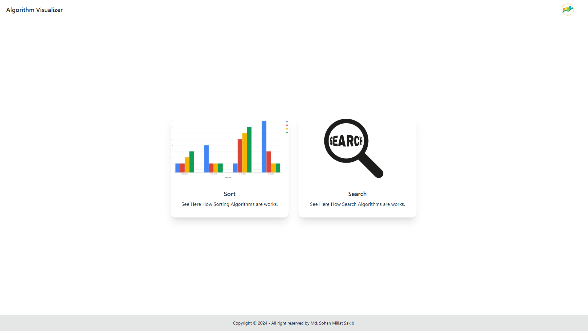

# Algorithm Visualizer

Welcome to **Algorithm Visualizer**, a React-based application designed for visualizing popular searching and sorting algorithms. This project was developed as part of a Data Structure lab to provide an interactive way to understand the internal workings of algorithms step-by-step.

Project Live Link: [https://algo-visualizing.netlify.app/](https://algo-visualizing.netlify.app/)



## Table of Contents

- [Algorithm Visualizer](#algorithm-visualizer)
  - [Table of Contents](#table-of-contents)
  - [Overview](#overview)
  - [Features](#features)
    - [Available Algorithms](#available-algorithms)
  - [Technology Stack](#technology-stack)
  - [Environment:](#environment)
  - [Installation](#installation)

## Overview

**Algorithm Visualizer** provides interactive visualizations of key data structure algorithms. With this tool, you can:

- Choose between different search and sort algorithms.
- Observe step-by-step execution for each selected algorithm.

This project includes:

- **Search Algorithms**: Binary Search and Linear Search.
- **Sort Algorithms**: Bubble Sort, Insertion Sort, and Selection Sort.

## Features

- **Dynamic Navigation**:
  - From the main page, select either the "Search" or "Sort" card.
  - Navigates to a page displaying the available algorithms for each category.
- **Detailed Visualization**:
  - Each algorithm provides a step-by-step visualization of its internal process.

### Available Algorithms

1. **Sort Algorithms**:
   - **Bubble Sort**: Shows the repeated swapping of adjacent elements to sort the array.
   - **Insertion Sort**: Demonstrates how elements are sorted one at a time by inserting them into the correct position.
   - **Selection Sort**: Visualizes the selection of the smallest (or largest) element from the unsorted portion and placing it in the sorted portion.
   -
2. **Search Algorithms**:

   - **Binary Search**: Visualizes the process of dividing the array to locate a target element in a sorted list.
   - **Linear Search**: Visualizes each step as the algorithm checks each element in the array sequentially.

## Technology Stack

- **Frontend**: React.js, React Router, Context API
- **Styling**: Tailwind CSS, DaisyUI.

## Environment:

You must have to need `Nodejs` installed in your local machine. Otherwise you can't Run or Build the project. You can check `Nodejs` with the command below:

```sh
node --version
```

You also need `Git` installed if you want to clone this repository.

## Installation

1. Clone the repository:

```sh
git clone https://github.com/MillatSakib/Algorithm-Visualizer-with-React.git
```

2. Go to `Algorithm-Visualizer-with-React` folder:

```sh
cd Algorithm-Visualizer-with-React
```

3. Install All Package:

```sh
npm i
```

4. Run or Build the Project.

   For Run

   ```sh
   npm run dev
   ```

   For Build

   ```sh
   npm run build
   ```
